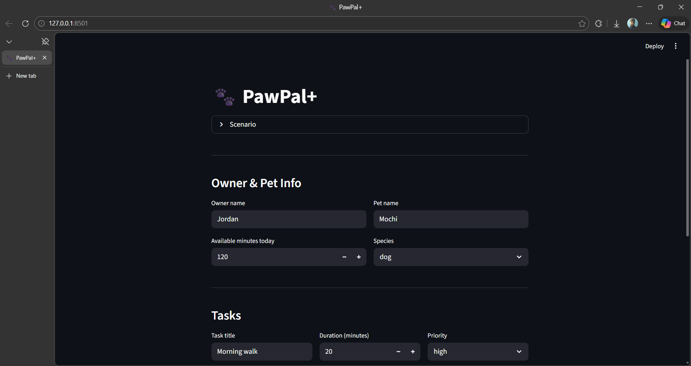

# PawPal+ (Module 2 Project)

You are building **PawPal+**, a Streamlit app that helps a pet owner plan care tasks for their pet.

## Scenario

A busy pet owner needs help staying consistent with pet care. They want an assistant that can:

- Track pet care tasks (walks, feeding, meds, enrichment, grooming, etc.)
- Consider constraints (time available, priority, owner preferences)
- Produce a daily plan and explain why it chose that plan

Your job is to design the system first (UML), then implement the logic in Python, then connect it to the Streamlit UI.

## What you will build

Your final app should:

- Let a user enter basic owner + pet info
- Let a user add/edit tasks (duration + priority at minimum)
- Generate a daily schedule/plan based on constraints and priorities
- Display the plan clearly (and ideally explain the reasoning)
- Include tests for the most important scheduling behaviors

## Getting started

### Setup

```bash
python -m venv .venv
source .venv/bin/activate  # Windows: .venv\Scripts\activate
pip install -r requirements.txt
```

### Suggested workflow

1. Read the scenario carefully and identify requirements and edge cases.
2. Draft a UML diagram (classes, attributes, methods, relationships).
3. Convert UML into Python class stubs (no logic yet).
4. Implement scheduling logic in small increments.
5. Add tests to verify key behaviors.
6. Connect your logic to the Streamlit UI in `app.py`.
7. Refine UML so it matches what you actually built.

## Features

The final PawPal+ implementation includes the following algorithmic features:

- Task model with priority, duration, earliest/latest time window, category, notes, and due date.
- Validation via `Task.is_valid()` to ensure constraints are a consistent schedule candidate.
- Recurring tasks support:
  - `frequency` of `once`, `daily`, or `weekly`
  - `Task.next_occurrence()` and `Task.mark_complete()` for rollover behavior
- Urgency scoring in `Task.urgency_score()` combining priority weight, time slack, and recurrence weight.
- Owner availability windows with `set_availability_windows_from_strings()` and hard daily minute cap.
- Feasibility checking in `Owner.is_task_feasible()` (windows, completed status, task bounds).
- Scheduler selects tasks by urgency and fits them greedily into availability windows without exceeding limits.
- Time slot assignment avoids overlap, and task drop reasoning is returned when no fit is found.
- Conflict detection (`Scheduler.detect_conflicts()`) with human-readable warnings and back-end plan explanation.
- Plan object (`Plan`) includes scheduled tasks, total duration, conflicts, and textual explanation.

## Smarter Scheduling

This version includes a stronger scheduler engine with:

- Task priority and urgency scoring (including overdue slack and recurrence weighting).
- Owner availability windows and maximum daily minutes to enforce hard schedule constraints.
- Conflict detection for overlapping tasks with non-crashing warnings.
- Recurring task support (`once`, `daily`, `weekly`) using `timedelta` for next due dates.
- Per-pet and completion-status filtering of task lists for better control.
- Human-readable plan explanation and dropped-task reasoning.

