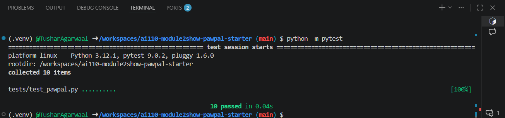

# PawPal+ Project Reflection

## 1. System Design

**a. Initial design**

- Briefly describe your initial UML design.

---I created 5 classes: Pet, Owner, Task, Plan and Scheduler. 

- What classes did you include, and what responsibilities did you assign to each?
--- Pet contains info about pets and has One to One relationship with the Owner, which has info about the owner of the pet.
Task is another class, containing info about care activity and has Many to One relationship to Owner.
All these 3 classes input data to the class Scheduler which then gives output in class Plan.

**b. Design changes**

- Did your design change during implementation?
--- Yes
- If yes, describe at least one change and why you made it.
--- Indeed the design changed, the classes didn't had all the relationships defined between them which made it succeptible to any logic bottleneck. AI suggested to look for time complexity related issue which was applied with the design.

---

## 2. Scheduling Logic and Tradeoffs

**a. Constraints and priorities**

- What constraints does your scheduler consider (for example: time, priority, preferences)?
--- It considers time-window constraint, priority/urgency, total available time, detects conflict or overlap, and also check for recurrence.
- How did you decide which constraints mattered most?
--- To fix time complexity and analysing various situations (eg. Two tasks scheduled at the same time) makes up to the constraints I chose for the classes.

**b. Tradeoffs**

- Describe one tradeoff your scheduler makes.
--- One is that my scheduler chooses tasks by priority, deadline and recurrence first before checking the "available minutes" with the Owner.

- Why is that tradeoff reasonable for this scenario?
--- It keeps the algorithm fast and simple, with O(n log n) sorting withing reasonable time.

---

## 3. AI Collaboration

**a. How you used AI**

- How did you use AI tools during this project (for example: design brainstorming, debugging, refactoring)?
--- I asked AI to create the architecture, to write code snippets, review test cases and suggest a better alternative for improvement.

- What kinds of prompts or questions were most helpful?
--- For example, "Suggest class diagram for the 5 classes" which helped in understanding the relationship between the classes and what to add in the code to improve those relationships.

**b. Judgment and verification**

- Describe one moment where you did not accept an AI suggestion as-is.
--- Initially while creating the UML diagram, AI suggested me a basic diagram with bad table elements and poorly defined relationships. I ran the code and manually applied the logic.

- How did you evaluate or verify what the AI suggested?
--- For UML diagram, I ran the code in Mermaid Live Editor, which gave me a clear picture of the logic applied by AI. Then I evaluated the code for better elements and relationships.

---

## 4. Testing and Verification

**a. What you tested**

- What behaviors did you test?
--- I tested for sorting, recurrence or conflict scenarios.

- Why were these tests important?
--- It helps in assigning the tasks correctly to create the best plan possible. Sometimes there are overlapping tasks, or one task completed but similar task needs to be scheduled for later date/time....., so in scenarios like these, testing was important to verify the changes applied.

**b. Confidence**

- How confident are you that your scheduler works correctly?
--- Very confident, 5 stars. It covers most of the scenarios with zero error.

- What edge cases would you test next if you had more time?
--- One would be Time details for the task shouldn't be negative or wrong format, to ensure the code doesn't break.

---

## 5. Reflection

**a. What went well**

- What part of this project are you most satisfied with?
--- Designing Systems with AI is something to learn from. It showed the potential and methods on how to use AI to improve an existing system.

**b. What you would improve**

- If you had another iteration, what would you improve or redesign?
--- I think I would have worked better with UI based on looks or even tried to add some animation to the app while surfing.

**c. Key takeaway**

- What is one important thing you learned about designing systems or working with AI on this project?
--- AI aids a lot in designing, but a proper logical oversight along with argument is constantly required for the smooth process. AI may be wrong and that's why we should be judgemental about it's every activity.
